**Laboratorio 7  DP-600**

**Create an ontology with Fabric IQ** 

In this lab, you’ll create a complete Fabric IQ ontology for a fictitious healthcare company by manually  building each  component—entity types,  properties, keys, relationships,  and  data  bindings.  The  sample  data  represents  hospitals, departments, rooms, patients, vital sign equipment, and vital signs readings. 

**Create a workspace** 

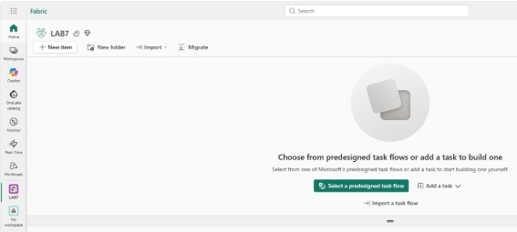

**Download and load the hospital data files** 

1. Download[ sample-data.zip ](https://github.com/MicrosoftLearning/mslearn-fabric/raw/main/Allfiles/Labs/23-24/sample-data.zip)and extract the CSV files to your local computer. The ZIP file contains: 

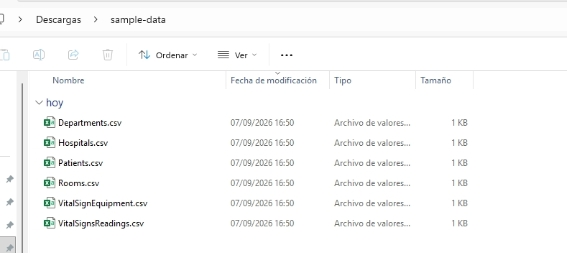

2. Upload the five lakehouse files: 

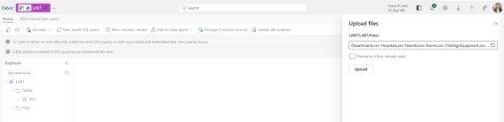

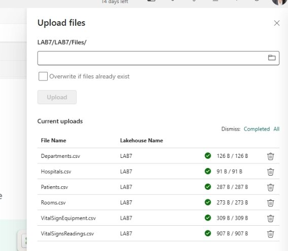

3. Convert each uploaded file to a table: 

   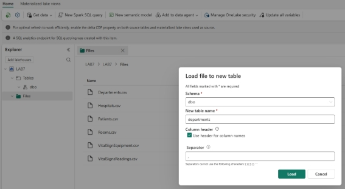

   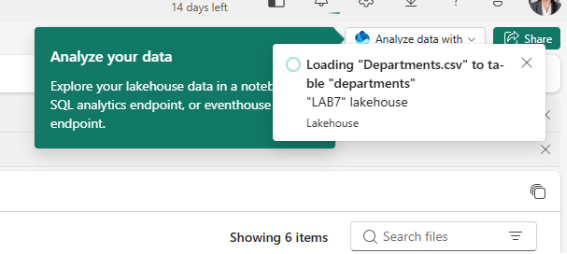

   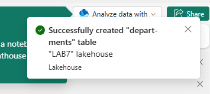

4. Verify  you  have  five  tables  in the **Tables** section: hospitals, departments, rooms, patients, 

   and vitalsignequipment as shown in the image below. 

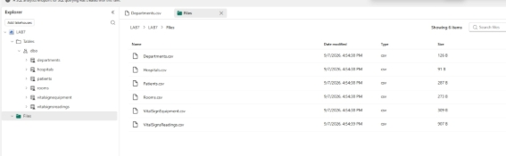

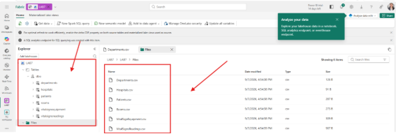

**Create an eventhouse with streaming data** 

Next, you’ll create an eventhouse to store real-time vital signs data that you’ll bind to the ontology later. 

1. In your workspace, select **+ New item** > **Eventhouse**. 
1. Name the eventhouse LamnaHealthcareEH and select **Create**. 
1. A  default  KQL  database  is  created  with  the  same  name.  Select  the  KQL database to open it. 

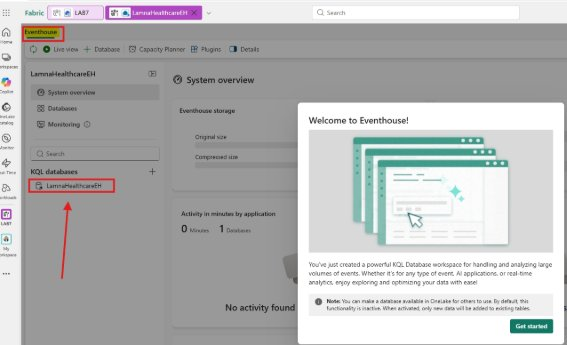

**Ingest vital signs data** 

1. In the KQL database, select **Get data** > **Local file**. 
1. In the **Select or create a destination table** section, select **+ New table** and enter VitalSignsReadings as the table name. 
1. Under **Add  up  to  1,000  files**,  select **Browse  for  files** and  upload  the VitalSignsReadings.csv file you downloaded earlier. 
1. Select **Next**, then continue through the ingestion wizard, keeping the default settings. 
1. Select **Finish** to complete the ingestion. 
1. Verify the **VitalSignsReadings** table appears in the KQL database. 

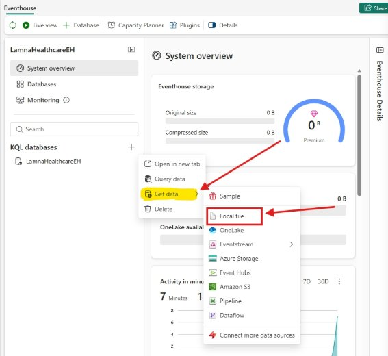

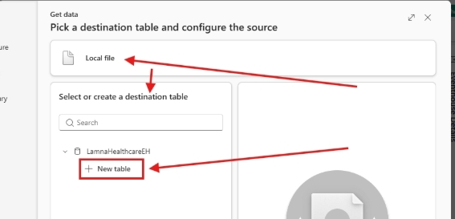

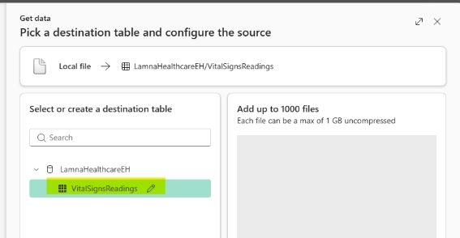

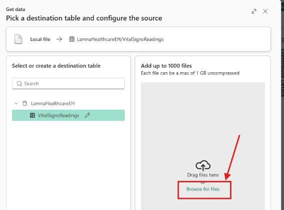

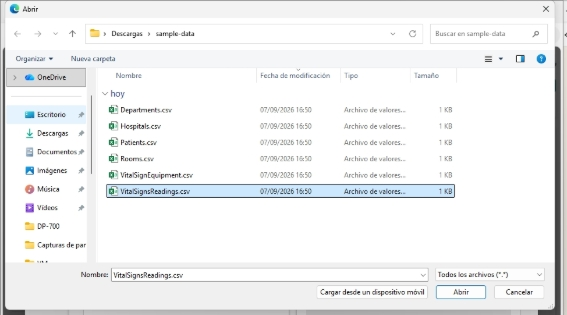

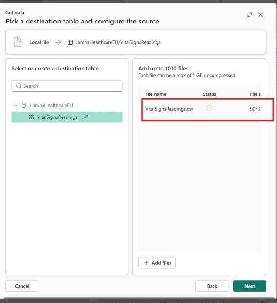

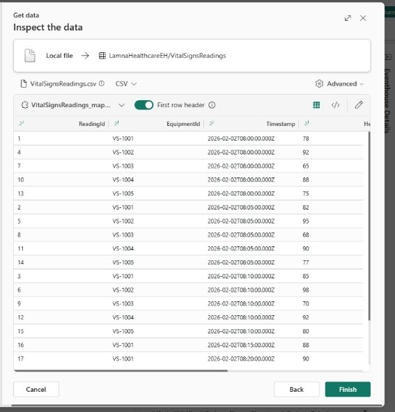

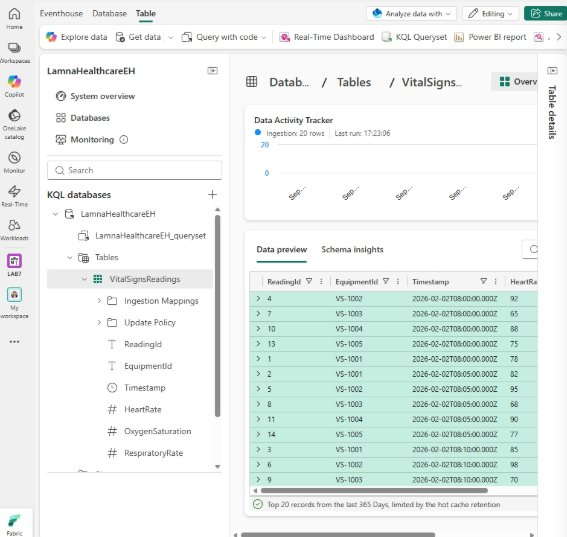

**Create an ontology** 

Now you’ll create an empty ontology and build it step by step. 

1. In your workspace, select **+ New item** > **Ontology (preview)**. 
1. Name the ontology LamnaHealthcareOntology and select **Create**. 
1. The  ontology  canvas  opens,  empty  and  ready  for  you  to  build  your  data model. 

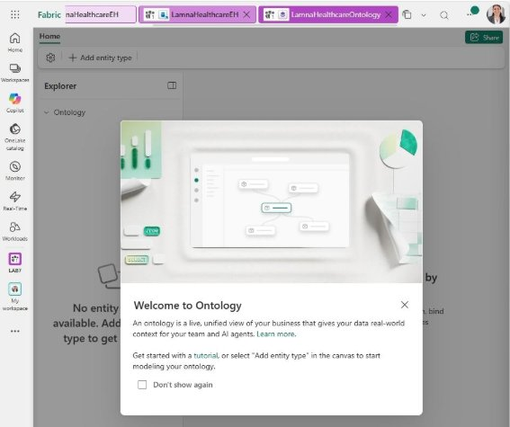

**Create entity types** 

You’ll  create  five  entity  types  representing  the  healthcare  domain.  Follow  the detailed steps for the first entity type to learn the process, then use the reference table to create the remaining four. 

Create Hospital entity type 

1. In the ontology ribbon, select **Add entity type**. 
1. Enter **Hospital** as the entity type name and select **Add Entity Type**. 
1. The Hospital entity type appears on the canvas. 
1. With  the  Hospital  entity  type  selected,  go  to  the **Entity  type configuration** pane on the right. 
1. Select the **Properties** tab, then select **Add properties**. 
1. Add each property by entering the details below and selecting **+ Add** after each one: 

|Property Name |Data Type |Property Type |
| - | - | - |
|HospitalId |Integer |Static |
|HospitalName |String |Static |
|City |String |Static |
|State |String |Static |

7. After adding all properties, select **Save**. 
7. Now you need to define an entity key. An entity key is a property that uniquely identifies each instance of the entity type. For hospitals, each hospital has a unique HospitalId, so this will be the key. 

Select **Key: Add entity type key** and choose **HospitalId** as the key, select **Save**. 

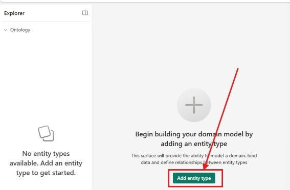

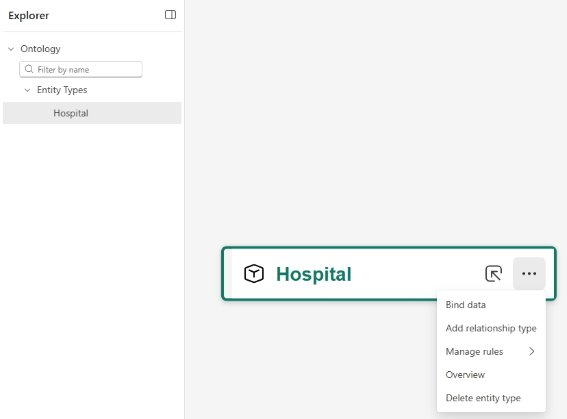

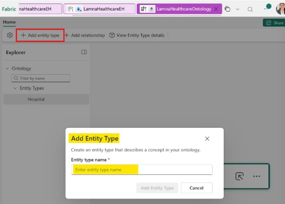

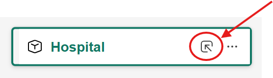

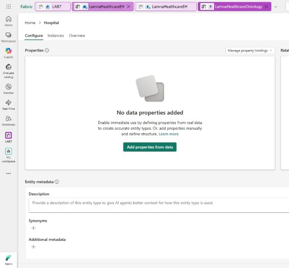

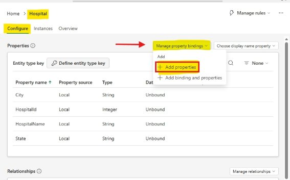

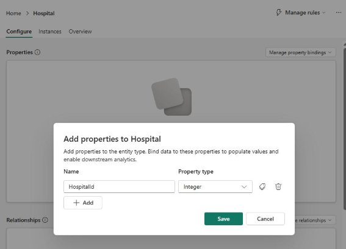

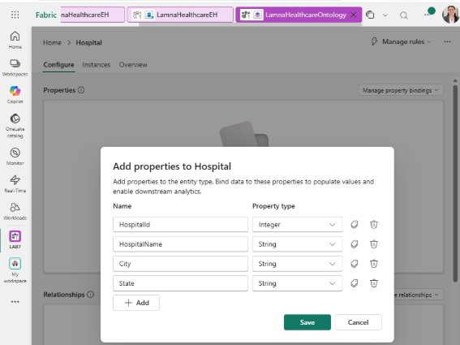

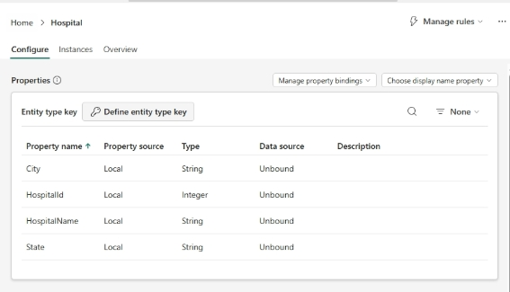

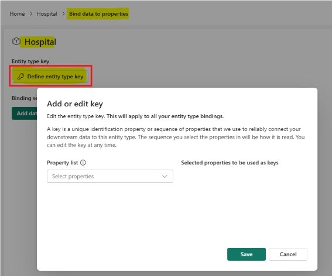

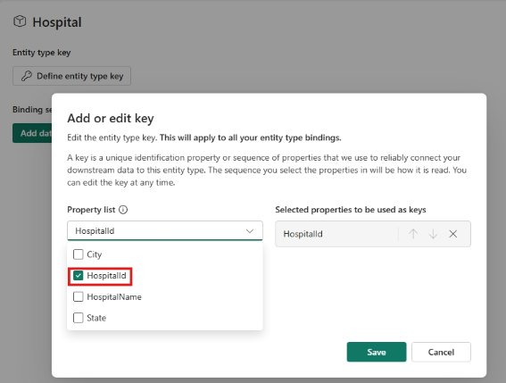

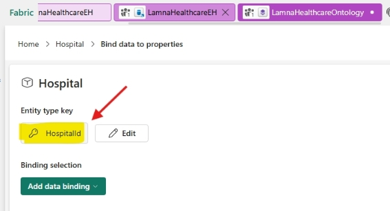

**Create remaining entity types** 

Follow  the  same  process  to  create  these  four  additional  entity  types  with  their properties and keys: 

||||||
| :- | :- | :- | :- | :- |
|Entity Type |Property Name |Data Type |Property Type |Entity  Type Key |
||||||
||||||
|**Department** |
DepartmentId DepartmentName HospitalId 

Floor 
|Integer String Integer Integer |Static Static Static Static |DepartmentId |
||||||
||||||
|**Room** |RoomId RoomNumber DepartmentId RoomType |Integer String Integer String |Static Static Static Static |RoomId |
||||||
||||||
|**Patient** |PatientId FirstName LastName DateOfBirth |Integer String String DateTime |
Static Static Static 

Static 
|PatientId |
||||||

||||||
| :- | :- | :- | :- | :- |
|Entity Type |Property Name |Data Type |Property Type |Entity  Type Key |
||||||
||||||
||AdmissionDate CurrentRoomId |DateTime Integer |Static Static ||
||||||
||||||
|**VitalSignEquipment** |EquipmentId PatientId EquipmentType MonitoringStartDate |String Integer String DateTime |Static Static Static Static |EquipmentId |
||||||
You now have five entity types with properties and keys defined. Verify that the Entity Types pane shows all five entity types, and that properties and entity type key have been defined for each entity: 

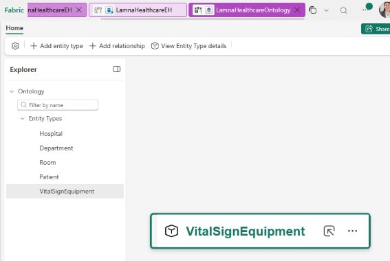

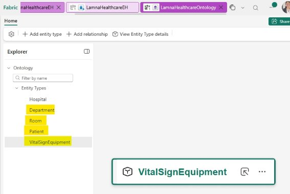

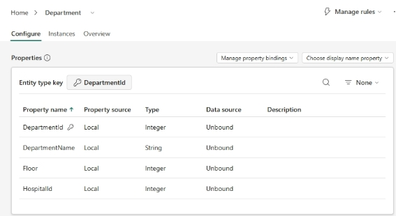

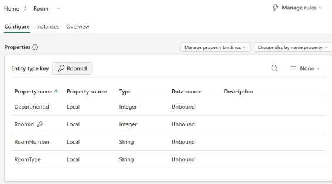

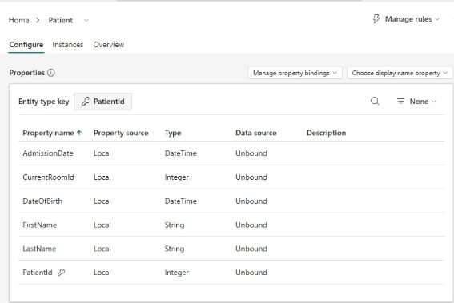

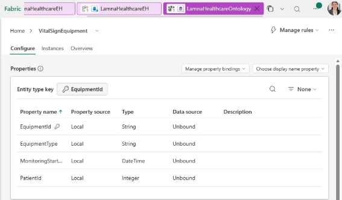

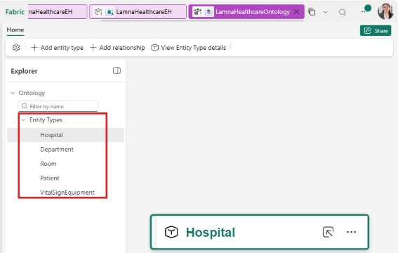

**Create relationship types** 

Now, you’ll create relationship types that model the healthcare entity relationships and  vital  sign  monitoring:  Hospital  →  Department  →  Room  →  Patient,  with VitalSignEquipment  monitoring  Patient.  Follow  the  detailed  steps  for  the  first relationship, then use the reference table to create the remaining three. 

Create Hospital-Department relationship 

1. In the ribbon, select **Add relationship**. 
1. In the **Add relationship type to ontology** dialog, configure: 
- **Relationship type name**: contains 
- **Source entity type**: Hospital 
- **Target entity type**: Department 
3. Select **Add relationship type**. 

The  Contains  relationship  line  appears  on  the  canvas  connecting  Hospital  to Department. You’ll configure the data source later. 

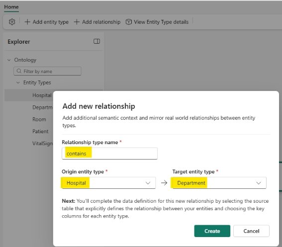

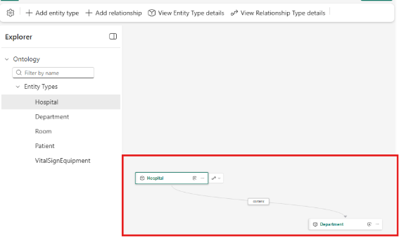

**Create remaining relationships** 

Follow the same process to create these four additional relationships: 

|||||
| :- | :- | :- | :- |
|Relationship Name |Source Entity Type |Target Entity Type |Meaning |
|||||
|||||
|**has** |Department |Room |Departments  have rooms |
|||||
|||||
|**assignedTo** |Patient |Room |Patients  are assigned to rooms |
|||||
|||||
|**monitors** |VitalSignEquipment |Patient |Vital  sign equipment monitors patients |
|||||
Your ontology canvas should look similar to the image below. Depending on canvas layout and which entities are selected, you may need to pan or zoom to view all entity types and relationship lines. 

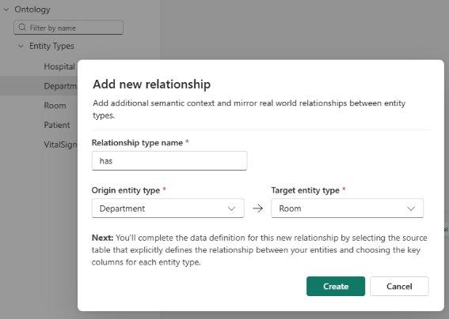

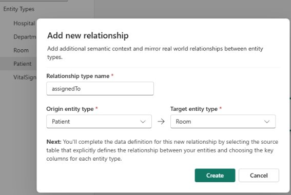

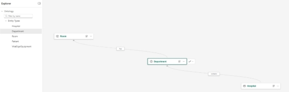

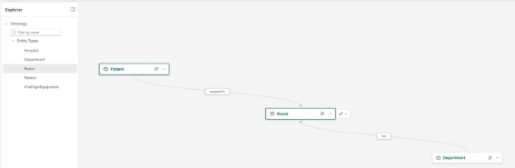

**Bind entity types to data** 

So far, you’ve defined the schema of your ontology—entity types with properties and keys—but these are just empty templates. To make the ontology functional, you must bind each entity type to actual data sources. This tells Fabric where to find the real healthcare data that will populate your ontology. 

You’ll bind static data from lakehouse tables to four entities, then add both static and time-series bindings to the VitalSignEquipment entity. 

**Bind Hospital entity** 

1. Select the **Hospital** entity type on the canvas. 
1. In the **Entity type configuration** pane, go to the **Bindings** tab. 
1. Select **Add data to entity type**. 
1. In the **OneLake catalog**, select **LamnaHealthcareLH** (lakehouse) from your workspace. 
1. Select **Connect**. 
1. Select the **hospitals** table and select **Next**. 
1. For **Binding type**, keep **Static**. 
8. Under **Bind  your  properties**,  map  each  property  to  its  corresponding column: 
- HospitalId → HospitalId 
- HospitalName → HospitalName 
- City → City 
- State → State 

The system usually auto-maps when names match. 

9. Select **Save**. 

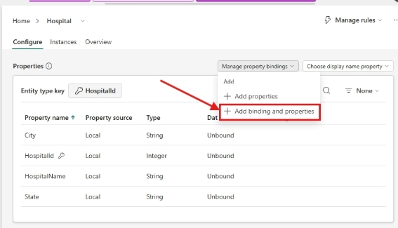

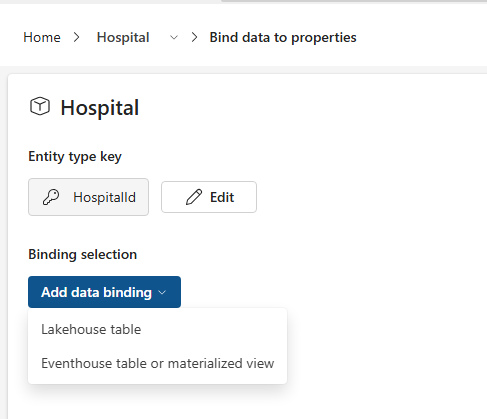

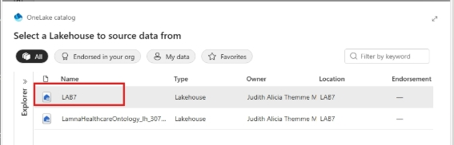

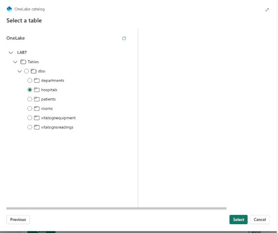

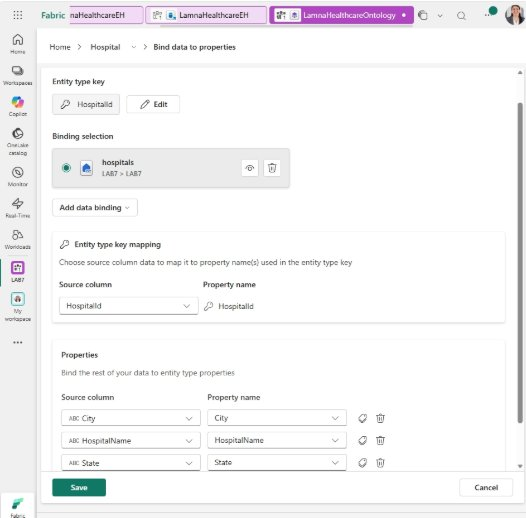

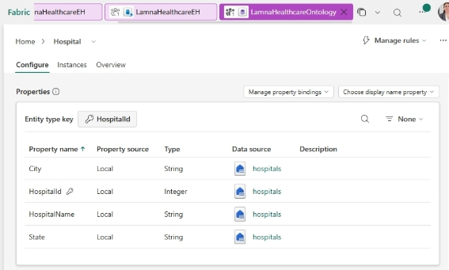

**Bind Department, Room, and Patient entities** 

Follow the same binding process for these three entities, which only require static data bindings. The system automatically maps columns to properties when names match—just verify the mappings are correct. 

||||
| :- | :- | :- |
|Entity Type |Table Name |Source Columns |
||||
||||
|**Department** |departments |
DepartmentId DepartmentName HospitalId 

Floor 
|
||||
||||
|**Room** |rooms |RoomId RoomNumber DepartmentId RoomType |
||||
||||
|**Patient** |patients |PatientId FirstName LastName DateOfBirth AdmissionDate CurrentRoomId |
||||

**Bind VitalSignEquipment entity** 

The VitalSignEquipment entity requires two data bindings: one for static equipment attributes  and  one  for  time-series  measurements.  Time-series  bindings  require static bindings first. Here’s why—look at what each data source contains: 

**VitalSignEquipment.csv** (Lakehouse - Static attributes): 

code 

EquipmentId | PatientId | EquipmentType           | MonitoringStartDate VS-1001     | 1001      | Continuous Monitoring   | 2026-02-01 

VS-1002     | 1002      | Continuous Monitoring   | 2026-02-01 **VitalSignsReadings.csv** (Eventhouse - Time-series measurements): code 

ReadingId | EquipmentId | Timestamp            | HeartRate | OxygenSaturation | RespiratoryRate 

1         | VS-1001     | 2026-02-02T08:00:00Z | 78        | 98               | 16 2         | VS-1001     | 2026-02-02T08:05:00Z | 82        | 97               | 18 

4         | VS-1002     | 2026-02-02T08:00:00Z | 92        | 99               | 14 

Notice the time-series data only has measurements and EquipmentId—not patient or  equipment  type.  The  static  binding  creates  the  equipment  entities  with  full context (VS-1001 is Continuous Monitoring equipment tracking Patient 1001), and the time-series binding attaches streaming measurements to those entities using EquipmentId as the matching key. 

![ref1]

**Configure relationships** 

Now you’ll configure each relationship type by specifying which table links the entity instances together. First you’ll configure one relationship using the details below, then use the reference table for the remaining four. 

**Configure Hospital-Department relationship** 

1. On the ontology canvas, select the **Hospital** entity, then select **contains** in the relationship line between Hospital and Department. 

   

2. In the **Relationship configuration** pane on the right, configure the source data location: 
- **Workspace**: Select your workspace 
- **Lakehouse**: Select **LamnaHealthcareLH** 
- **Schema**: Select **dbo** 
- **Table**: Select **departments** 

**Note**: The departments table works as the relationship source because it contains keys for both Hospital (HospitalId) and Department (DepartmentId). The hospitals table wouldn’t work here because it only contains HospitalId. 

3. Configure the entity type mappings by selecting columns that match the key properties defined on each entity: 
- Under **1. Source entity type**: Select **Hospital** (change from default if needed) 
  - **Source  column**:  Select **HospitalId** (matches  the  HospitalId key defined on the Hospital entity) 
- Under **2. Target entity type**: Select **Department** (change from default if needed) 
  - **Source  column**:  Select **DepartmentId** (matches  the DepartmentId key defined on the Department entity) 

Your relationship configuration should look like this: 

![ref1]

**Preview the ontology** 

Your ontology is now complete with entities, relationships, static data, and time- series data—all built manually from the ground up. 

1. Select **Room** from the Entity Types list. 
1. In the ontology ribbon, select **Entity type overview**. 
1. You’ll see an “Updating your ontology” message while the system processes your  data  in  the  background.  After  1-2  minutes,  refresh  your  browser  to display the entity type overview. 

You’ll see tiles showing: 

- **Relationship  graph**:  Visual  representation  of  how  this  entity  type connects to other entity types 
- **Property  charts**:  Bar  charts  showing  the  distribution  of  property values (like RoomType, RoomNumber, or DepartmentId) 
- **Entity instances table**: List of all individual room instances with their properties 

**Clean up resources** 

[ref1]: Aspose.Words.72f25874-7094-4144-8cb7-b6a6e901462e.056.jpeg
